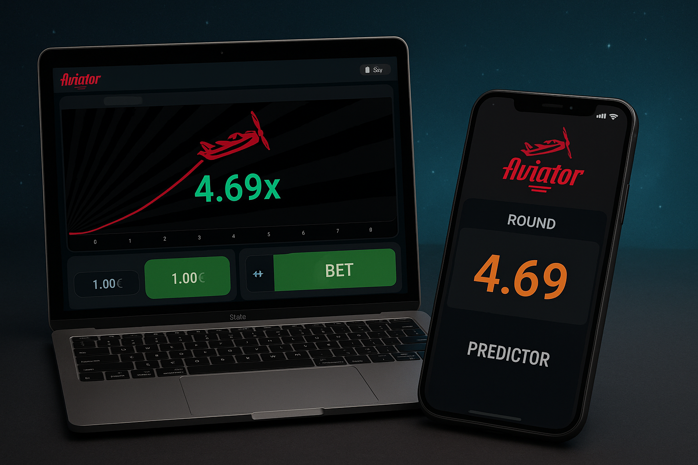

  

✈️ Aviator Crash Game — Clone + Predictor
Aviator Crash Game is a thrilling multiplayer experience where players test their timing and instincts to win! With a sleek UI, predictor logic, and real-time gameplay, this version is ideal for testing or launching with further upgrades.

📞 Contact
Want to buy the source code or collaborate?

📱 Telegram: @GHOSTANAME777

🌟 Features
🎮 Game Mechanics

Place your bet and watch the multiplier rise.

Cash out before the plane crashes.

Predictor helps calculate crash probability.

📈 Highlights

Real-time logic.

JS-based predictor.

Fast, responsive UI.

Can be upgraded with payments and user auth.

🔐 Transparency & Security

No backend by default — frontend logic only.

Can be extended for production use.

🛠️ Tech Stack

HTML / JS / (or React optionally)

Lightweight & mobile-friendly

Ready for customization and deployment

